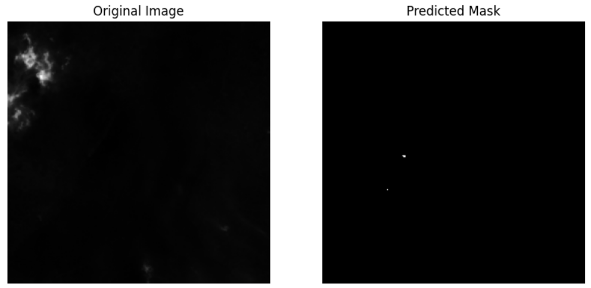
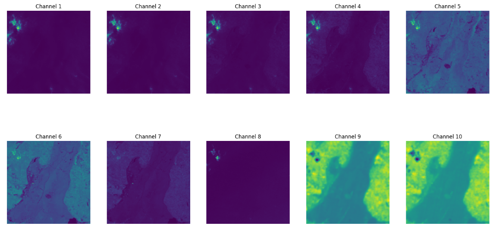

# AI-SPARK

## Description
제 6회 2024 연구개발특구 AI SPARK 챌린지: 산불 감지 챌린지
https://aifactory.space/task/2723/overview

위성 데이터를 활용한 실시간 산불 감시 및 조기 탐지를 통해 산불 재난을 모니터링하고 예측하는 솔루션을 개발하는 문제입니다. 본 대회는 공개된 활성산불 이미지 및 영상 데이터를 사용하여 인공지능 기반의 산불 재난 감시·탐지·예방·대응 솔루션을 개발하여 적용하는 데에 목적을 두고 있습니다.

**Team 열린moon, 89.4(19th)**

## Process
1. Dataset Preprocess(10 채널 이미지)
2. TransUnet 모델을 이용하여 설계
3. Attention Mechanism을 추가한 TransAttentionUnet 모델 사용(개인 최고점수 달성)
4. SwinTransformer 활용(평가에 적용x)

## Visualization

## References
- Attention U-Net: Learning Where to Look for the Pancreas" by Ozan Oktay et al. (2018)
https://arxiv.org/abs/1804.03999
- Remote Wildfire Detection using Multispectral Satellite Imagery and Vision Transformers
https://proceedings.mlr.press/v222/rad24a.html
